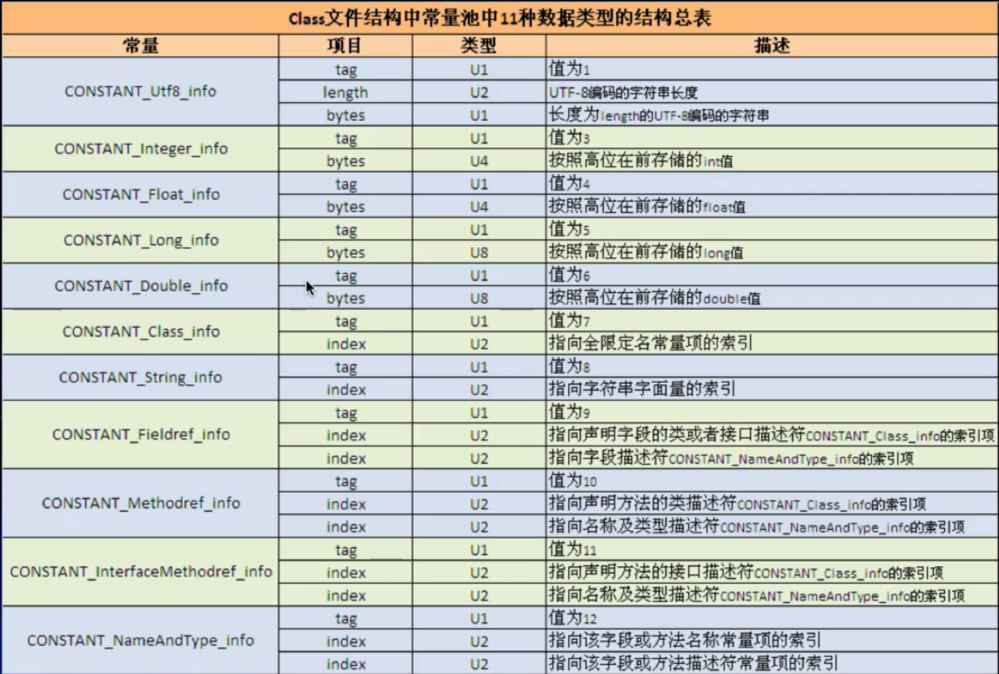

# 字节码 10个部分组成
软件：hex fiend 
Idea插件：BinEd

## 1) 魔术 4字节
CAFEBABE

## 2) 版本号 4字节
次版本 minor version  2字节
主版本 major version  2字节

00 00 00 34 表示次版本0，主版本52，即 1.8.0

## 3) 常量池 2+n个字节
主要存储两类常量：字面量 & 符号引用
字面量：文本字符串等
符号引用：类和接口的全局限定名(binary name)，字段和方法的名称和描述符

在JVM规范中，字段和方法都有描述信息，描述字段的类型，方法的参数类型、个数和返回类型

基本类型和void用一个大写字母表示，对象类型用字母L加类的全限定名称(点'.'替换成了斜杠'/')表示
byte - B
short - S
char - C
int - I
long - J
float - F
double - D
boolean - Z
void - V
L - 对象类型;  如 Ljava/lang/String;

数组：
每一个维度，使用一个左方括号`[` 来表示，如 
  `int[]` 表示成 `[I`
  `String[]` 表示成 `[Ljava/lang/String;` 

### 常量池数量 2字节
数组的元素个数 - 1
索引从 1 开始
索引为 0 代表null

### 常量池数组(常量表)
与一般数组不同的是，数组中的元素类型可以是不同的
每一个元素的`第一个字节`都是 类型标识

采用的常量池元素类型有 11 种

## 4) Access Flags 2字节

## 5) This Class Name 2字节

## 6) Super Class Name 2字节

## 7) Interfaces 2+n个字节

## 8）Fields  2+n个字节

## 9) Methods  2+n个字节

## 10) Attributes  2+n个字节
