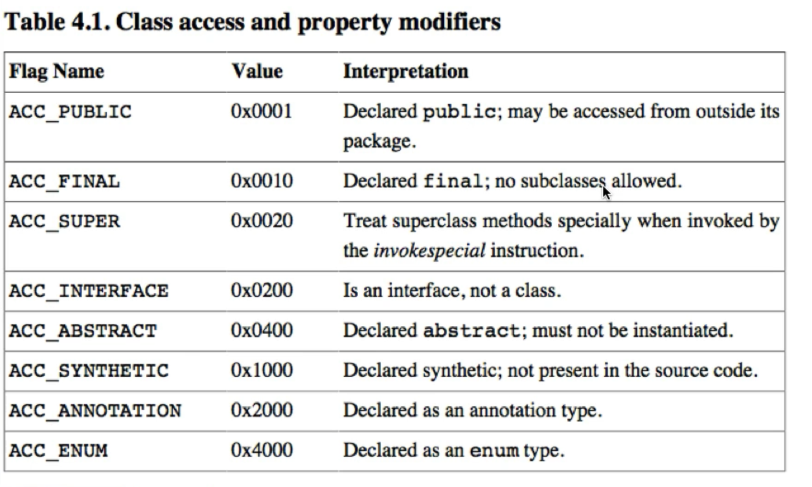

# 字节码 10个部分组成
软件：hex fiend 
Idea插件：BinEd

字节码查看工具, 有Idea插件， [jclasslib](https://github.com/ingokegel/jclasslib)


```text
ClassFile {
  u4 Magic;
  u4 minor(u2) + major(u2);
  u2 cp_info_count;
  cp_info constant_pool[cp_info_count-1];
  u2 access_flags;
  u2 this_class;
  u2 super_class;
  u2 interface_name_index_count;
  u2 interface_name_index[interface_name_index_count];
  u2 field_count;
  field_info fields[field_count];
  u2 method_count;
  method_info methods[method_count];
  u2 attribute_count;
  attribute_info attributes[attribute_count];
}
```

access flag: 
- ACC_PUBLIC     0X0001
- ACC_PRIVATE    0X0002
- ACC_PROTECTED  0X0004
- ACC_STATIC     0X0008
- ACC_FINAL      0X0010
- ACC_SUPER      0X0020
- ACC_NATIVE     0X0100
- ACC_INTERFACE  0X0200
- ACC_ABSTRACT   0X0400
- ACC_SYNTHETIC  0X1000
- ACC_ANNOTATION 0X2000
- ACC_ENUM       0X4000


## 1) 魔术 4字节
CAFEBABE

## 2) 版本号 4字节
次版本 minor version  2字节
主版本 major version  2字节

00 00 00 34 表示次版本0，主版本52，即 1.8.0

## 3) 常量池 2字节+(n-1)个常量表
主要存储两类常量：字面量 & 符号引用
字面量：文本字符串等
符号引用：类和接口的全局限定名(binary name)，字段和方法的名称和描述符

在JVM规范中，字段和方法都有描述信息，描述字段的类型，方法的参数类型、个数和返回类型

基本类型和void用一个大写字母表示，对象类型用字母L加类的全限定名称(点'.'替换成了斜杠'/')表示
byte - B
short - S
char - C
int - I
long - J
float - F
double - D
boolean - Z
void - V
L - 对象类型;  如 Ljava/lang/String;

数组：
每一个维度，使用一个左方括号`[` 来表示，如 
  `int[]` 表示成 `[I`
  `String[]` 表示成 `[Ljava/lang/String;` 

### 常量池数量 2字节
数组的元素个数 - 1
索引从 1 开始
索引为 0 代表null

### 常量表 n-1个
与一般数组不同的是，数组中的元素类型可以是不同的
每一个元素的`第一个字节`都是 类型标识

采用的常量表元素类型有 11 种

- 1  UTF8
- 3  Integer
- 4  Float
- 5  Long
- 6  Double
- 7  Class
- 8  String
- 9  Fieldref
- 10 Methodref
- 11 InterfaceMethodref
- 12 NameAndType

## 4) Access Flags 2字节


## 5) This Class Name 2字节
常量池索引

## 6) Super Class Name 2字节
常量池索引

## 7) Interfaces 2+n个字节
接口个数 + n个接口名的常量池索引

## 8）Fields  2+n个字段表
包含了 静态字段 和 实例字段
字段个数 + n个字段表


```text
field_info {
  u2 access_flags;
  u2 name_index;
  u2 descriptor_index;
  u2 attribute_count;
  attribute_info attributes[attribute_count];
}
```

## 9) Methods  2+n个方法表
方法个数 + n个方法表(method_info)


```text
method_info {
  u2 access_flags;
  u2 name_index;
  u2 descriptor_index;
  u2 attribute_count;
  attribute_info attributes[attribute_count];
}
```

其中，attribute的一般结构：
```text
attribute_info {
  u2 attribute_name_index;
  u4 attribute_length;
  u1 info[attribute_length];
}
```

不同的 attribute 通过 attribute_name_index 区分。

JVM 预定义了部分 attribute，编译器也可以自定义自己的 attribute 写入到 class 文件中，供运行时使用。

```text
code_attribute {
  u2 attribute_name_index; // Code
  u4 attribute_length;
  u2 max_stack;
  u2 max_locals;
  u4 code_length;
  u1 code[code_length];
  u2 exception_table_length;
  {
    u2 start_pc;
    u2 end_pc;
    u2 handler_pc;
    u2 catch_type;
  } exception_table[exception_table_length];  // 异常表
  u2 attribute_count;
  attribute_info attributes[attribute_count]; // 嵌套的 attribute， LineNumberTable、LocalVariableTable等
}
```

exception_table
  start_pc 到 end_pc 之间的代码发生的异常，由 handler_pc 所指向的代码处理，
  catch_type 表示处理的异常类型的常量池中引用，当catch_type 为 0 时，表示处理任何异常

LineNumberTable
  用来表示code数组中的字节码和Java代码行数之间的关系。这个属性可以用来在调试的时候定位代码执行的行数

```text
LineNumberTable_attribute {
  u2 attribute_name_index; // LineNumberTable
  u4 attribute_length;
  u2 line_number_table_length;
  {
    u2 start_pc;
    u2 line_numner;
  } line_number_table[line_number_table_length];
}
```

```text
LocalVariableTable_attribute {
  u2 attribute_name_index; // LocalVariableTable
  u4 attribute_length;
  u2 local_variable_table_count;
  {
    u2 start_pc;
    u2 length;
    u2 nameIndex; // 常量池引用
    u2 descriptorIndex; // 常量池引用
    u2 index;
  } local_variable_table[local_variable_table_count];
}
```

## 10) Attributes  2+n个属性表

```text
SourceFile_attribute {
  u2 attribute_name_index; // SourceFile
  u4 attribute_length;
  u2 source_file_name_index;
}
```
