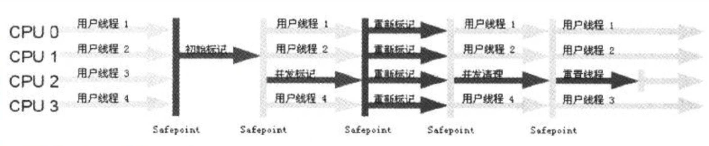

# 垃圾回收 (gc)

## 垃圾判断算法
- 引用计数算法 (Reference Counting)
给对象添加一个引用计数器，当有一个引用指向它，计数器加1；当引用失效，计数器减1，任何时刻计数器为0的对象就是不可能再被使用的。
引用计数算法无法解决对象循环引用的问题。

- 根搜索算法 (Root Tracing)
通过一系列 "GC Roots" 的点作为起始进行搜索，当一个对象到 GC Roots 没有任何引用链(Reference Chain)相连，则证明此对象是不可用的。

在 Java 语言中，GC Roots 包括：
  在虚拟机栈中(本地变量)的的引用
  方法区中的静态引用 （那方法区中的GC怎么办？）
  JNI(Native方法)中的引用

方法区
  - JVM规范表示可以不要求虚拟机在这个区域实现GC，因为性价比一般比较低
  - 常规应用在 新生代 的一次 GC 一般可以回收 70% ~ 95% 的空间
  - 当前的商业 JVM 都有实现方法区的GC，主要回收两部分内容：废弃常量与无用类

  
## 垃圾回收算法

- 标记-清除算法(Mark-Sweep)
  算法分为"标记"和"清除"两个阶段，首先标记出所有需要回收的对象，然后回收所有需要回收的对象。
  缺点
    效率问题：标记和清除两个过程效率都不高，堆越大，GC越慢
    空间问题：标记清除之后，会产生内存碎片

- 标记-整理算法(Mark-Compact)
  标记过程是一样的，但后续不是直接清除，而是往一端移动，然后直接清除掉另外一端的内存。
  没有内存碎片。
  耗费时间整理(压缩)

— 复制算法(Copying)
  将内存划分为两块，每次只使用其中一块，当其中一个区内存使用完了，将还存活的对象复制到另外一个区。
  不会有内存碎片问题。
  缺点：浪费一半内存

  Oracle HotSpot 中，新生代使用了这种算法。默认情况下，Eden 和 survivor 的比例是 8:1:1，只有10%的内存`浪费`。
  缺点：对象存活率较高时，回收效率有所下降

- 分代回收算法(Generation)
  分为新生代和老年代
  新生代每次GC都有大批对象死去，使用「复制算法」
  对象在eden区出生，当eden满的时候，存活的对象复制到一个Survivor区。当一个Survivor区满时，此区存活的对象和eden区存活的对象复制到另外一个survivor区。
  老年代一般采用"标记-清除"或"标记-整理"算法
  可以根据具体应用需求选择合适的垃圾回收器，吞吐量？响应时间？

内存分配
  - 堆上分配，大多数对象在eden区分配，偶尔会直接在老年区分配
  - 栈上分配，局部变量

引用类型：
- Strong 
- Soft:内存不够时一定会被GC，长期不用也会被GC
- Weak:一定会被GC，会在Reference Queue中通知
- Phantom:本来就没引用，当从jvm heap 中回收时会通知

## 垃圾回收器的实现和选择


- ScaVenge GC(Minor GC)
  触发时机：Eden空间满了
  理论上Eden区大多数对象都会在ScaVenge GC回收，复制算法的效率很高。
- Full GC
  对整个JVM堆回收
  主要触发时机：Old满了；Perm满了；System.gc()
  效率很低，尽量减少Full GC
  Stop The World (STW)

垃圾收集器的 并行 和 并发
- 并行(Parallel): 指多个收集器的线程同时工作，但用户线程处于等待状态
- 并发(Concurrent): 指收集器在工作的同时，可以允许用户线程工作。并发不代表解决了GC停顿问题，在关键的步骤还是要停顿，如标记垃圾的时候。
                    但在清除垃圾的时候，用户线程可以和GC线程并发执行。


## 垃圾收集器
- Serial 收集器 
  最早的收集器
  单线程收集器，收集时会暂停所有用户线程。虚拟机在Client模式下，默认使用此收集器。                    
  在新生代，使用复制算法；在老年代，使用复制-整理算法
  优点：单线程，没有多线程切换开销，简单实用
  
  
- ParNew 收集器
  是Serial收集器的多线程版本，除了在垃圾收集时使用多个收集线程外，其余行为包括算法、STW、对象分配规则、回收策略都与Serial收集器一样。
  Server模式下的默认新生代收集器
  可以通过 -XX:ParallelGCThreads 来控制GC线程数
  缺点：在单CPU内核的情况下，并不会比Serial收集器有很好的效果

- Parallel Scavenge 收集器
  也是一个多线程收集器，也是使用复制算法，但它的分配规则与回收策略都与ParNew收集器有所不同，它是以`吞吐量(`GC时间占总运行时间)最大化为
  目标的收集器实现，它允许较长时间的STW换取总吞吐量最大化
  
- Serial Old 收集器
  是单线程收集器，使用 复制-整理算法，是老年代的收集器

- Parallel Old 收集器
  老年代版本`吞吐量`优先收集器，使用多线程 和 标记-整理算法
  JVM1.6提供，在此之前，新生代使用Parallel Scavenge收集器的化，老年代只能选择Serial Old，因为Parallel Scavenge 无法与 CMS收集器配合工作
  
  Parallel Scavenge + Parallel Old = 高吞吐量，但GC停顿时间可能不理想

- CMS 收集器 (Concurrent Mark Sweep)
  CMS 是一种与最短停顿时间为目标的收集器，使用CMS并不能达到GC效率最高(总体GC时间最少)，但它能尽可能降低GC时服务的停顿时间
  CMS收集器使用 标记-清除算法，会导致碎片问题。碎片过多时，可能导致 Full GC
  使用 -XX:UseConcMarkSweepGC 打开
  追求最短停顿时间，非常适合Web应用

# gc

[JvmGCLab1](../src/jvm/gc/lab1)  // -Xms20m -Xmx20m -Xmn10m -XX:SurvivorRatio=8 -verbose:gc -XX:+PrintGCDetails

```text
-verbose:gc  // 单独用这个：[GC (Allocation Failure)  5786K->4728K(19456K), 0.0035605 secs]，添加-XX:+PrintGCDetails后，[GC (Allocation Failure) [PSYoungGen: 5786K->560K(9216K)] 5786K->4664K(19456K), 0.0033368 secs] [Times: user=0.03 sys=0.01, real=0.00 secs] 
-Xms20m // 初始堆大小 等价于 -XX:InitialHeapSize=20m
-Xmx20m // 最大堆大小 等价于 -XX:MaxHeapSize=20m
-Xmn10m  // 新生代的大小
-XX:+PrintGCDetails  // 貌似有这个参数，就不需要 -verbose:gc 了
-XX:SurvivorRatio=8 // eden:from:to = 8:1:1 = 8m:1m:1m
```

old-gen.used = (young.before - young.after) - (heap.before - heap.after)


## 查看默认JVM启动参数：
```text
>> java -XX:+PrintCommandLineFlags -version
-XX:InitialHeapSize=268435456 -XX:MaxHeapSize=4294967296 -XX:+PrintCommandLineFlags -XX:+UseCompressedClassPointers -XX:+UseCompressedOops -XX:+UseParallelGC 
java version "1.8.0_201"
Java(TM) SE Runtime Environment (build 1.8.0_201-b09)
Java HotSpot(TM) 64-Bit Server VM (build 25.201-b09, mixed mode)
```
重点在 `-XX:+UseParallelGC `，新生代使用 Parallel Scavenge，老年代使用 Parallel Old


## -XX:PretenureSizeThreshold=2097152  // 超过 2M ，就直接在老年代创建，需配合 -XX:+UseSerialGC
晋升的依据：根据要创建的对象大小
[JvmGCLab2](../src/jvm/gc/lab2)  // -XX:PretenureSizeThreshold=2097152 -XX:+UseSerialGC -XX:+PrintGCDetails


## -XX:MaxTenuringThreshold=5 // 对象最大到5岁，就会进入老年代
晋升的依据：根据对象年龄
经过多次GC后，存活的对象会在From Survivor 和 To Survivor 直接来回存放，每次GC后，会计算对象的年龄，如果达到某个年龄后发现总大小已经
大于Survivor空间的50%,那么此时就需要调整阈值，不能再继续等到阈值最大值，需要让这些还存活的对象尽快晋升到老年代。

-XX:TargetSurvivorThreshold=60   // 存活的对象超过Survivor空间的60%就重新计算对象晋升的阈值
-XX:+PrintTenuringDistribution  // 打印对象在Survivor空间中的年龄情况
-XX:+PrintGCDataStamps  // 打印GC时间戳
-XX:+UseConcMarkSweepGC // 老年代使用 CMS收集器
-XX:+UseParNewGC // 新生代使用 ParNew收集器

# 安全点
在OopMap的协助下，HotSpot可以快速且准确地完成GC Roots枚举，但一个现实的问题随之而来：
  可能导致引用关系变化，或者说OopMap内容变化的指令非常多，如果为每一条指令都生成对应的OopMap，那将会需要大量的额外空间，这样GC的空间成本将会更高。

实际上，HotSpot并没有为每条指令都生成OopMap，而只是在"特定的位置"记录了这些信息，这些位置称为`安全点（SafePoint）`，
即程序执行时并非在所有地方都能停顿下来开始GC，只有在达到安全点时才能暂停。

SafePoint的选定既不能太少让GC等待时间太长，也不能太多以至于过分增大运行时负载。所以安全点的选定是以"是否具有让程序长时间执行的特征"为标准
进行选定的：因为每条指令执行的时间非常短暂，程序不太可能因为指令流长度太长这个原因而过长时间运行，"长时间执行"的最明显特征就是指令序列复用，
例如方法调用、循环跳转、异常跳转等，所以具有这些功能的指令才会产生SafePoint。

对于SafePoint，另一个需要考虑的问题是如何在GC发生时让所有线程（这里不包括执行JNI调用的线程）都跑到最近的安全点上再停顿下来：抢占式中断
（Preemptive Suspension）和主动式中断(Voluntary Suspension)

## 抢占式中断
它不需要线程的执行代码主动去配合，在GC发生时，首先把所有线程全部中断，如果有线程中断的地方不在安全点上，就恢复线程，让它跑到安全点上。

## 主动式中断
当GC需要中断线程时，不直接对线程操作，仅仅简单设置一个标识，各个线程执行时主动轮询这个标识，发现中断标志为真时就自己中断挂起。
`轮询标志的地方和安全点是重合的`，另外再加上创建对象需要分配内存的地方。

现在几乎没有虚拟机采用抢占式中断来暂停线程从而响应GC事件。

# 安全区域
如果程序在"不执行"的时候，即没有分配到CPU时间，典型的例子就是处于Sleep状态或者Blocked状态，这时候线程无法响应JVM的中断请求，JVM显然
也不太可能等待线程重新分配CPU时间。对于这种情况，就需要`安全区域(Safe Region)`来解决了。

在线程执行到 安全区域 中的代码时，首先标识自己已经进入到Safe Region，这样，当在这段时间里JVM要发起GC时，
就不用管标识自己为Safe Region状态的线程了。在线程要离开Safe Region时，它要检查系统是否已经完成了根节点枚举
（或者是整个GC过程），如果完成了，那线程就继续执行，否则就等待直到收到可以离开安全区域的信号为止。

# CMS收集器
CMS收集器以获取最短回收停顿时间为目标，适用于互联网应用或者B/S系统的服务器端。


CMS是基于"标记-清除"算法实现的，整个过程分为4个步骤：
- 初始标记(initial mark)  需要STW
只是标记一下GC Roots能直接关联到的对象，速度很快

- 并发标记(concurrent mark)
进行 GC Roots Tracing 的过程

- 重新标记(remark)        需要STW
为了修正并发标记期间因用户程序继续运作而导致标记产生变动的那一部分对象的标记记录，这个阶段的停顿时间一般会比初始标记阶段
稍长一些，但远比并发标记的时间短。

- 并发清除(concurrent Sweep)

## CMS收集器的缺点
- CMS收集器对CPU资源非常敏感
- CMS无法处理`浮动垃圾(Floating Garbage)`，可能出现"Concurrent Mode Failure"失败而导致另一次Full GC的产生。
如果在应用中，老年代增长不是太快，可以适当调高参数 -XX:CMSInitialingOccupancyFraction 的值来提高触发百分比，
以便降低内存回收次数从而获取更好的性能。要是CMS运行期间预留的内存无法满足程序需要时，虚拟机将启动后备预案：临时启动
Serial Old 收集器来重新进行老年代的垃圾收集，这样停顿时间就很长了。所以说参数 -XX:CMSInitiatingOccupancyFraction
设置得太高很容易导致大量"Concurrent Mode Failure"失败，性能反而降低
- 收集结束时，会有大量空间碎片产生，空间碎片过多时，将会给大对象分配带来很大麻烦，往往出现老年代还有很大空间剩余，
但是无法找到足够大的连续空间来分配当前对象，不得不提前进行一次Full GC。CMS提供了一个 -XX:+UseCMSCompactAtFullCollection开关参数，
默认就是开启的，用于在CMS顶不住要进行Full GC时开启内存碎片的合并整理过程，内存整理的过程是无法并发的，空间碎片问题没有了，但停顿时间变长。

