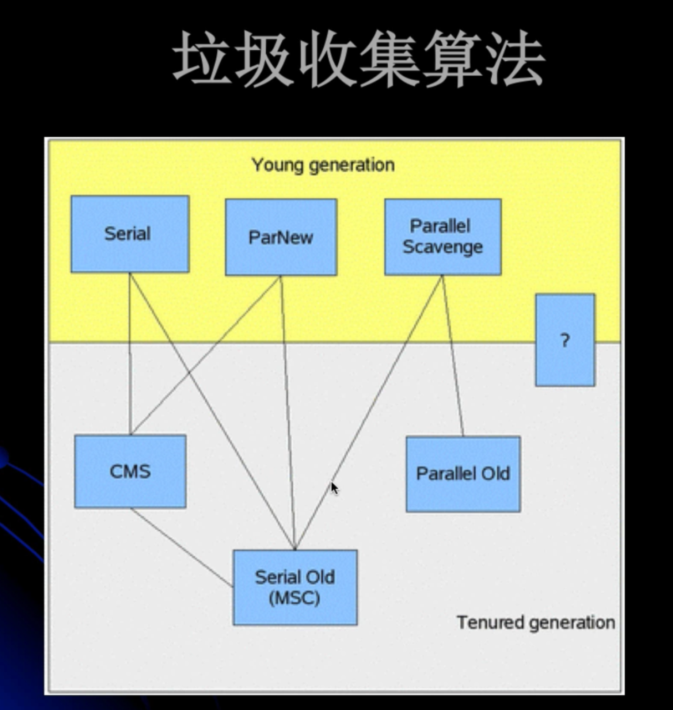
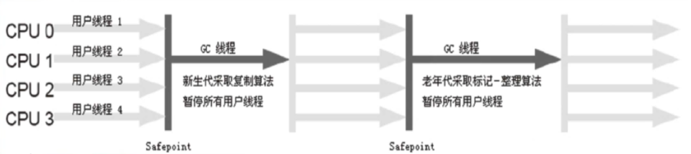
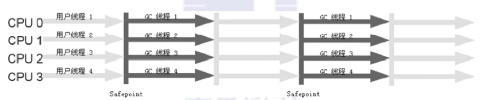

# 垃圾回收 (gc)

## 垃圾判断算法
- 引用计数算法 (Reference Counting)
给对象添加一个引用计数器，当有一个引用指向它，计数器加1；当引用失效，计数器减1，任何时刻计数器为0的对象就是不可能再被使用的。
引用计数算法无法解决对象循环引用的问题。

- 根搜索算法 (Root Tracing)
通过一系列 "GC Roots" 的点作为起始进行搜索，当一个对象到 GC Roots 没有任何引用链(Reference Chain)相连，则证明此对象是不可用的。

在 Java 语言中，GC Roots 包括：
  在虚拟机栈中(本地变量)的的引用
  方法区中的静态引用 （那方法区中的GC怎么办？）
  JNI(Native方法)中的引用

方法区
  - JVM规范表示可以不要求虚拟机在这个区域实现GC，因为性价比一般比较低
  - 常规应用在 新生代 的一次 GC 一般可以回收 70% ~ 95% 的空间
  - 当前的商业 JVM 都有实现方法区的GC，主要回收两部分内容：废弃常量与无用类

  
## 垃圾回收算法

- 标记-清除算法(Mark-Sweep)
  算法分为"标记"和"清除"两个阶段，首先标记出所有需要回收的对象，然后回收所有需要回收的对象。
  缺点
    效率问题：标记和清除两个过程效率都不高，堆越大，GC越慢
    空间问题：标记清除之后，会产生内存碎片

- 标记-整理算法(Mark-Compact)
  标记过程是一样的，但后续不是直接清除，而是往一端移动，然后直接清除掉另外一端的内存。
  没有内存碎片。
  耗费时间整理(压缩)

— 复制算法(Copying)
  将内存划分为两块，每次只使用其中一块，当其中一个区内存使用完了，将还存活的对象复制到另外一个区。
  不会有内存碎片问题。
  缺点：浪费一半内存

  Oracle HotSpot 中，新生代使用了这种算法。默认情况下，Eden 和 survivor 的比例是 8:1:1，只有10%的内存`浪费`。
  缺点：对象存活率较高时，回收效率有所下降

- 分代回收算法(Generation)
  分为新生代和老年代
  新生代每次GC都有大批对象死去，使用「复制算法」
  对象在eden区出生，当eden满的时候，存活的对象复制到一个Survivor区。当一个Survivor区满时，此区存活的对象和eden区存活的对象复制到另外一个survivor区。
  老年代一般采用"标记-清除"或"标记-整理"算法
  可以根据具体应用需求选择合适的垃圾回收器，吞吐量？响应时间？

内存分配
  - 堆上分配，大多数对象在eden区分配，偶尔会直接在老年区分配
  - 栈上分配，局部变量

引用类型：
- Strong 
- Soft:内存不够时一定会被GC，长期不用也会被GC
- Weak:一定会被GC，会在Reference Queue中通知
- Phantom:本来就没引用，当从jvm heap 中回收时会通知

## 垃圾回收器的实现和选择



- ScaVenge GC(Minor GC)
  触发时机：Eden空间满了
  理论上Eden区大多数对象都会在ScaVenge GC回收，复制算法的效率很高。
- Full GC
  对整个JVM堆回收
  主要触发时机：Old满了；Perm满了；System.gc()
  效率很低，尽量减少Full GC
  Stop The World (STW)

垃圾收集器的 并行 和 并发
- 并行(Parallel): 指多个收集器的线程同时工作，但用户线程处于等待状态
- 并发(Concurrent): 指收集器在工作的同时，可以允许用户线程工作。并发不代表解决了GC停顿问题，在关键的步骤还是要停顿，如标记垃圾的时候。
                    但在清除垃圾的时候，用户线程可以和GC线程并发执行。


## 垃圾收集器
- Serial 收集器 
  最早的收集器
  单线程收集器，收集时会暂停所有用户线程。虚拟机在Client模式下，默认使用此收集器。                    
  在新生代，使用复制算法；在老年代，使用复制-整理算法
  优点：单线程，没有多线程切换开销，简单实用
  
  
- ParNew 收集器
  是Serial收集器的多线程版本，除了在垃圾收集时使用多个收集线程外，其余行为包括算法、STW、对象分配规则、回收策略都与Serial收集器一样。
  Server模式下的默认新生代收集器
  可以通过 -XX:ParallelGCThreads 来控制GC线程数
  缺点：在单CPU内核的情况下，并不会比Serial收集器有很好的效果

- Parallel Scavenge 收集器
  也是一个多线程收集器，也是使用复制算法，但它的分配规则与回收策略都与ParNew收集器有所不同，它是以`吞吐量(`GC时间占总运行时间)最大化为
  目标的收集器实现，它允许较长时间的STW换取总吞吐量最大化
  
- Serial Old 收集器
  是单线程收集器，使用 复制-整理算法，是老年代的收集器

- Parallel Old 收集器
  老年代版本`吞吐量`优先收集器，使用多线程 和 标记-整理算法
  JVM1.6提供，在此之前，新生代使用Parallel Scavenge收集器的化，老年代只能选择Serial Old，因为Parallel Scavenge 无法与 CMS收集器配合工作
  
  Parallel Scavenge + Parallel Old = 高吞吐量，但GC停顿时间可能不理想

- CMS 收集器 (Concurrent Mark Sweep)
  CMS 是一种与最短停顿时间为目标的收集器，使用CMS并不能达到GC效率最高(总体GC时间最少)，但它能尽可能降低GC时服务的停顿时间
  CMS收集器使用 标记-清除算法，会导致碎片问题。碎片过多时，可能导致 Full GC
  使用 -XX:UseConcMarkSweepGC 打开
  追求最短停顿时间，非常适合Web应用

# gc

[JvmGCLab1](../src/jvm/gc/lab1)

```text
-verbose:gc  // 单独用这个：[GC (Allocation Failure)  5786K->4728K(19456K), 0.0035605 secs]，添加-XX:+PrintGCDetails后，[GC (Allocation Failure) [PSYoungGen: 5786K->560K(9216K)] 5786K->4664K(19456K), 0.0033368 secs] [Times: user=0.03 sys=0.01, real=0.00 secs] 
-Xms20m // 初始堆大小 等价于 -XX:InitialHeapSize=20m
-Xmx20m // 最大堆大小 等价于 -XX:MaxHeapSize=20m
-Xmn10m  // 新生代的大小
-XX:+PrintGCDetails  // 貌似有这个参数，就不需要 -verbose:gc 了
-XX:SurvivorRatio=8 // eden:from:to = 8:1:1 = 8m:1m:1m
```

old-gen.used = (young.before - young.after) - (heap.before - heap.after)

