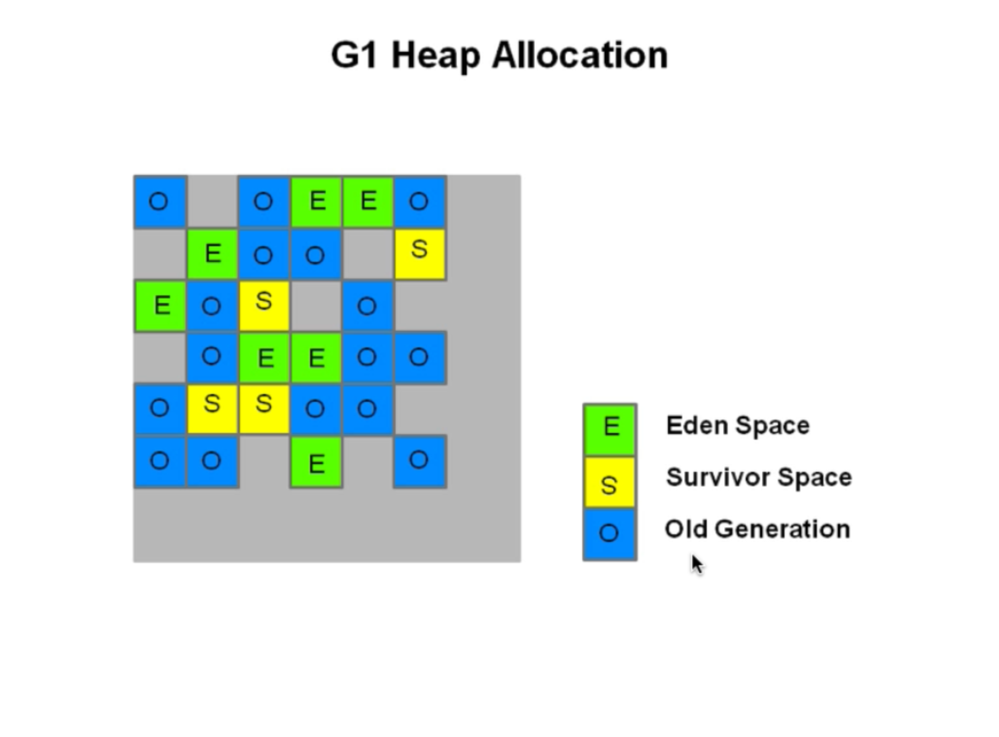

# G1(Garbage First)收集器

官方文档：https://www.oracle.com/technetwork/tutorials/tutorials-1876574.html

- heap 被划分为一个个相等的不连续的内存区域(region)，每个region都有一个分代的角色:eden、survivor、old
- 对每个角色的数量并没有强制的限定，也就是说对每个分代的内存的大小，可以动态变化
- G1最大的特点就是高效的执行回收，优先区执行那些大量对象可回收的区域(region)

- G1使用了gc停顿可预测的模型，来满足用户设定的gc停顿时间，根据用户设定的目标时间，G1会自动地选择哪些region要清除，一次清除多少个region
- G1从多个region中复制存活的对象，然后集中放入一个region中，同时整理、清除内存(copying算法)

## 收集器对比
- 对比使用 mark-sweep 的 CMS，G1使用的copying算法不会造成内存碎片
- 对比Parallel Scavenge（基于copying）、Parallel Old收集器（mark-compact-sweep），Parallel会对整个区域做整理导致停顿时间较长，
  而G1只是特定地整理几个region
- G1并非一个实时的收集器，与parallel Scavenge一样，对gc停顿时间的实质并不会绝对生效，只是G1由较高的几率保证不超过设定的gc停顿时间，
  与之前的gc收集器对比，G1会根据用户设定的gc停顿时间智能评估哪几个region需要被回收可以满足用户的设定。

## G1重要概念
- 分区(region)： G1采用了不用的策略来解决并行、串行和CMS收集器的碎片、暂停时间不可控等问题：G1将等个堆分成相同大小的分区。
- 每个分区都可能是年轻代也可能是老年代，但是在同一时刻只是属于某个代。年轻代、幸存代、老年代这些概念还存在，成为逻辑上的概念，
  这样方便复用之前分代框架的逻辑。
- 在物理上不需要连续，则带来了额外的好处：有的分区内垃圾对象特别多，有的分区内垃圾对象少，G1会优先回收垃圾对象相对多的分区，
  这样可以话费较少的时间来回收这些分区的垃圾，这也即使G1名字的由来，即首先收集垃圾最多的分区。
- 依然是在新生代满了的时候，对整个新生代进行回收：整个新生代中的对象，要么被回收，要么晋升，至于新生代也采取分区机制的原因，则是
  因为这样跟老年代的策略统一，方便调整代的大小
- G1还是一种带压缩的收集器，在回收老年代的分区时，是将存活的对象从一个分区拷贝到另一个可用分区，这个拷贝的过程就实现了局部的压缩
- 收集集合(CSet):一组可被回收的分区集合。在CSet中存活的数据会在gc过程中被移动到另一个可用分区，CSet中的分区可以来自eden、survivor或者old
- 已记忆集合(RSet):记录了其他region中的对象引用到本region中对象的关系，属于points-into结构（谁引用了我的对象）。RSet的价值在于
  使得垃圾回收器不需要扫描整个堆找到谁应用了当前分区中的对象，只需要扫描RSet即可。
- Snapshot-At-The-Begining(SATB): SATB是G1 GC在并发标记阶段使用的增量式的标记算法
- 并发标记是并发多线程的，但并发线程在同一时刻只扫描一个分区

## G1 GC 模式
- G1提供了两种GC模式，Young GC和Mixed GC，两种都是完全Stop The World的
- Young GC：选定所有年轻代里的Region。通过控制年轻代的Region个数，即年轻代内存大小来控制Young GC的时间开销
- Mixed GC：选定所有年轻代里的Region，外加根据global concurrent marking统计得出收集收益高的若干个老年代Region。在用户选定的开销目标
  范围内，尽可能选择收益高的老年代Region
- Mixed GC不是Full GC，它只能回收部分老年代的Region，如果Mixed GC实在无法跟上程序分配内存的速度，导致老年代填满无法继续进行Mixed GC,
  就会使用Serial old GC（Full GC）来收集整个GC heap。所以本质上，G1不提供Full GC

## global concurrent marking
global concurrent marking 的执行过程类似于CMS，不同的是，在G1 GC中，它主要是为Mixed GC提供标记服务的，并不是一次GC过程中的必须环节

global concurrent marking 的执行过程分为四个步骤：
- 初始标记(initial mark, STW)：它标记了从GC Root 开始直接可达的对象
- 并发标记(Concurrent marking)：这个阶段从 GC Root 开始对heap中的对象进行标记，标记线程与应用程序线程并发执行，并且收集各个Region的
  存活对象信息
- 重新标记(Remark, STW)：标记那些在并发标记阶段发生变化的对象，将被回收。
- 清理(Cleanup)：清除空region（对象都死亡），加入到free list

第一阶段 initial mark 是共用了Young GC的暂停，这是因为他们可以复用root scan 操作，所以可以说global concurrent marking是伴随
Young GC而发生的。

第四阶段Cleanup只是回收了没有存活对象的Region，所以它不需要STW

## G1在运行过程中的主要模式
- YGC
- 并发阶段
- 混合模式
- Full GC（一般是G1出现问题时发生）

G1 YGC在Eden充满时触发，在回收之后，所有之前属于Eden的区块全部变成空白，即不属于任何一个分区（Eden、Survivor、Old）

什么时候发生Mixed GC？
- 由一些参数控制，另外也控制着哪些老年代Region会被选入CSet
- G1HeapWastePercent：在global concurrent marking结束之后，我们可以直到old gen regions中有多少空间要被回收，
  在每次YGC之后和再次发生Mixed GC之前，会检查垃圾占比是否达到此参数，只有达到了，下次才会发生Mixed GC
- G1MixedGCLiveThresholdPercent：old gen regions中的存活对象的占比，只有在此参数之下，才会被选入CSet
- G1MixedGCCountTarget：一次global concurrent marking之后，最多执行Mixed GC的次数
- G1OldCSetRegionThresholdPercent：一次Mixed GC中能被选入CSet的最多old gen regions 数量

